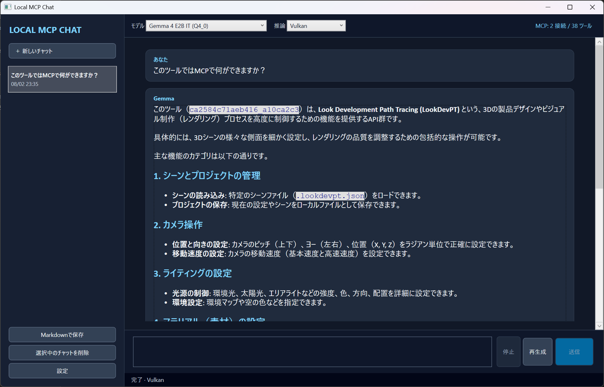
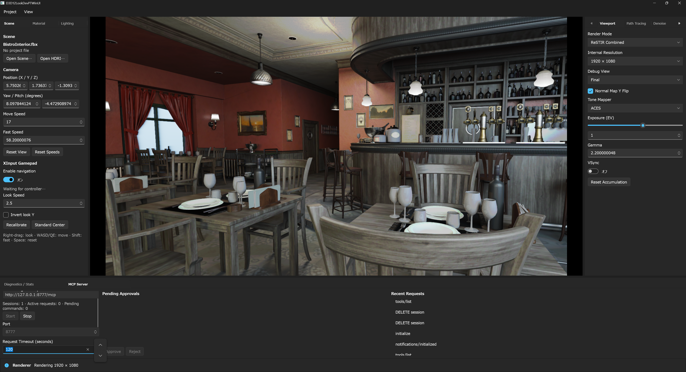

# LocalMCPChatClient

Gemma 4 E2B/E4Bをローカルで実行し、MCPツールを人間の承認付きで利用できるWindows向けチャットクライアントです。モデル推論、会話履歴、MCP設定は端末内に保存され、アプリからテレメトリやクラウドLLMへの送信は行いません。

現在のバージョンは`0.1.1`です。変更内容は[CHANGELOG](CHANGELOG.md)を参照してください。

> [!IMPORTANT]
> `0.1.1`は配布物のライセンス表示を修正したリリースです。`0.1.0`の配布物では第三者ライセンス通知を確認できないため、`0.1.1`以降を使用してください。

> [!WARNING]
> MCPサーバーは、承認後にファイルやネットワークへアクセスする可能性があります。信頼できるサーバーだけを登録し、承認画面に表示されるツール名と引数を確認してください。

## 現在の機能

- Gemma 4 E2B/E4B公式Instruction Tuned QAT GGUF、および任意のローカルGGUF
- アプリ管理の`llama-server`によるOpenAI互換SSEストリーミング
- Auto / CPU / NVIDIA CUDA / Vulkan推論、生成停止、再生成、モデル切り替え
- MCP C# SDKによるstdio / Streamable HTTP接続
- Tool Callの引数検証、「今回のみ許可」「常に許可」「拒否」と実行結果表示
- SQLiteによる会話履歴、Markdown対応チャット表示、会話単位のMarkdown保存
- Windows Credential Managerを利用したMCP資格情報の保存
- 推論・モデル登録・MCP・承認・資格情報をまとめて初期化する設定リセット
- 再開可能ダウンロード、空き容量確認、SHA-256検証、既存ファイルのインポート
- self-contained `win-x64` Portable発行
- 配布物へのライセンス通知同梱と、設定画面からのライセンス表示

初期版では、テキストチャットとMCP Toolsを対象とします。クラウドLLM、マルチモーダル入力、MCP Resources / Prompts、旧SSE transport、OAuth、非Windows GUIは対象外です。

## 画面とMCP連携例

| LocalMCPChatClient | 接続先のMCPサーバーアプリ |
|:---:|:---:|
|  |  |
| ローカルGemmaが接続済みToolsを理解し、日本語で説明している画面 | [D3D12LookDevPTWinUI3](https://github.com/shaderjp/D3D12LookDevPTWinUI3)のレンダラー画面。下部のMCP Serverパネルからローカルエンドポイントを起動する |

この例では、LocalMCPChatClientからD3D12/DXRレンダラーへ接続し、利用可能な機能の確認や露出変更をチャットで行っています。接続からTool Call確認までの手順は[D3D12LookDevPTWinUI3との連携例](docs/d3d12lookdevpt-integration.md)を参照してください。4枚目の画面は別リポジトリのMCPサーバーアプリであり、本アプリや配布物には含まれません。

## すぐに使う

GitHub Releaseでは次の2形式を配布します。どちらも.NETランタイムの追加インストールは不要です。

| 成果物 | 用途 |
|---|---|
| `LocalMCPChatClient-0.1.1-win-x64.zip` | 展開して使う通常のPortable版。構成ファイルを確認しやすい |
| `LocalMCPChatClient-0.1.1-win-x64.exe` | アプリ本体を1ファイルにまとめたself-contained版 |

SHA-256ファイルも各成果物と一緒に配布します。単体EXEにはモデルと`llama-server`は含まれず、ネイティブ依存関係は実行時に一時ディレクトリへ展開される場合があります。

Portable ZIPには`LICENSE.txt`、`THIRD-PARTY-NOTICES.txt`、詳細な`licenses`フォルダーを同梱します。単体EXEでは「設定」→「承認とプライバシー」→「ライセンス情報を表示」から、同じライセンスと第三者通知を確認できます。Releaseにはアプリ本体のライセンスと第三者通知も個別ファイルとして添付します。

Portable ZIPを使う場合は任意の書き込み可能なフォルダーへ展開し、`LocalMCPChatClient.exe`を起動します。単体EXEはダウンロードしたファイルを直接起動できます。

初回セットアップでは次を行います。

1. 検出されたハードウェアを確認する
2. Gemma 4 E2BまたはE4Bを選択する
3. CPU / CUDA / Vulkanバックエンドを選択する
4. 各コンポーネントのライセンスを確認する
5. 「ダウンロードして開始」を選択する

モデルと`llama-server`を既に持っている場合は「既存ファイルを使用」から登録できます。詳しい手順は[はじめに](docs/getting-started.md)を参照してください。

## 動作環境

| 項目 | 内容 |
|---|---|
| 対応OS | Windows 10/11 x64 |
| アプリのターゲット | `net9.0-windows` / `net9.0` |
| 開発SDK | .NET 10 SDK 10.0.300以降（`global.json`で選択） |
| Visual Studio | Visual Studio Community 2026で検証済み。「.NETデスクトップ開発」ワークロードが必要 |
| GPU | CUDAは対応NVIDIAドライバー、VulkanはVulkan対応ドライバーが必要 |

組み込みカタログ上のモデルサイズは約3.35 GB（E2B）または5.15 GB（E4B）です。ダウンロード途中ファイルと展開先を含む十分な空き容量を確保してください。

## 開発を始める

```powershell
git clone https://github.com/shaderjp/LocalMCPChatClient.git
cd LocalMCPChatClient
./scripts/bootstrap.ps1
```

その後、`LocalMCPChatClient.sln`をVisual Studioで開き、`LocalMCPChatClient.App`をスタートアッププロジェクトにします。CLIから起動する場合は次を実行します。

```powershell
dotnet run --project src/LocalMCPChatClient.App/LocalMCPChatClient.App.csproj
```

Visual StudioとCLIの詳しい手順は[開発ガイド](docs/development.md)を参照してください。

## ドキュメント

| 資料 | 対象 | 内容 |
|---|---|---|
| [はじめに](docs/getting-started.md) | 利用者 | インストール、初回セットアップ、最初のチャット |
| [操作ガイド](docs/user-guide.md) | 利用者 | 画面、推論設定、履歴、ツール承認 |
| [MCP設定ガイド](docs/mcp-configuration.md) | 利用者・MCP開発者 | stdio / HTTP設定、秘密情報、接続項目 |
| [D3D12LookDevPTWinUI3との連携例](docs/d3d12lookdevpt-integration.md) | 利用者 | MCPサーバーの起動、接続、チャットからのレンダラー操作 |
| [トラブルシューティング](docs/troubleshooting.md) | 利用者・開発者 | 推論、モデル、MCP、設定、ログの確認方法 |
| [開発ガイド](docs/development.md) | 開発者 | Visual Studio、ビルド、テスト、発行、リポジトリ規約 |
| [リリース手順](docs/releasing.md) | メンテナー | バージョン更新、成果物検証、タグとGitHub Release |
| [アーキテクチャ](docs/architecture.md) | 開発者 | プロジェクト境界、推論・MCP・保存の設計 |
| [MCPプロファイル例](docs/mcp-profile-examples.json) | 開発者 | 保存されるJSON形状の参考例 |

## 保存場所

| データ | 既定の場所 |
|---|---|
| 一般設定、MCPプロファイル | `%LocalAppData%\LocalMCPChatClient\settings.json` |
| SQLite会話履歴 | `%LocalAppData%\LocalMCPChatClient\history.db` |
| モデル | `%LocalAppData%\LocalMCPChatClient\Models`（変更可） |
| llama.cpp | `%LocalAppData%\LocalMCPChatClient\Runtimes` |
| 一時ダウンロード | `%LocalAppData%\LocalMCPChatClient\Downloads` |
| 診断ログ | `%LocalAppData%\LocalMCPChatClient\Logs` |

秘密として入力したMCPヘッダーと環境変数はWindows Credential Managerに保存され、`settings.json`には参照名だけが記録されます。モデル、ランタイム、DB、ログはGit管理対象外です。

## ビルドとテスト

```powershell
dotnet restore LocalMCPChatClient.sln
dotnet build LocalMCPChatClient.sln -c Release --no-restore
dotnet test LocalMCPChatClient.sln -c Release --no-build
dotnet publish src/LocalMCPChatClient.App/LocalMCPChatClient.App.csproj `
  -c Release -r win-x64 --self-contained true -o artifacts/portable
dotnet publish src/LocalMCPChatClient.App/LocalMCPChatClient.App.csproj `
  -c Release -p:PublishProfile=win-x64-single-file -o artifacts/single-file
```

GitHub ActionsでもWindows上でrestore、build、test、Portable ZIPと単体EXEの発行、SHA-256作成、大容量ファイル検査を実行します。

## ライセンス

本リポジトリのソースコードは[MIT License](LICENSE)です。アプリに同梱するライブラリと.NET/WPFランタイムの通知は[THIRD-PARTY-NOTICES.txt](THIRD-PARTY-NOTICES.txt)および[licenses](licenses)に収録しています。ダウンロードされるモデルと推論ランタイムには、それぞれの配布元ライセンスが適用されます。

- [Gemma 4 E2B model card](https://huggingface.co/google/gemma-4-E2B-it-qat-q4_0-gguf)
- [Gemma 4 E4B model card](https://huggingface.co/google/gemma-4-E4B-it-qat-q4_0-gguf)
- [llama.cpp](https://github.com/ggml-org/llama.cpp)
- [Model Context Protocol C# SDK](https://github.com/modelcontextprotocol/csharp-sdk)
