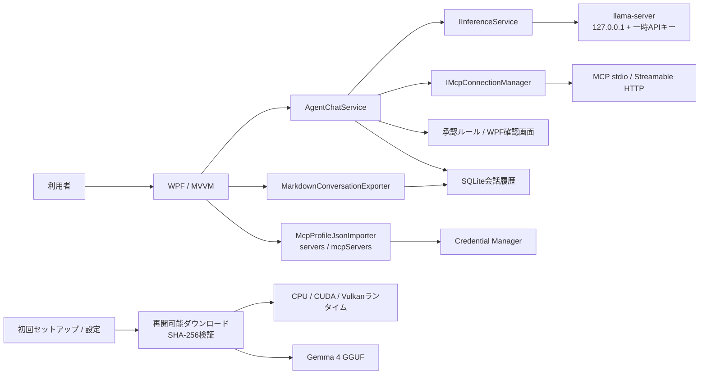
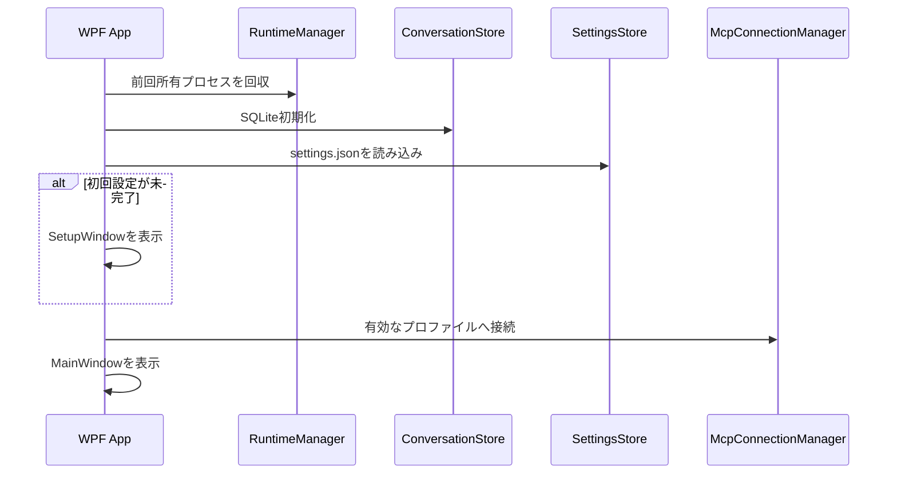
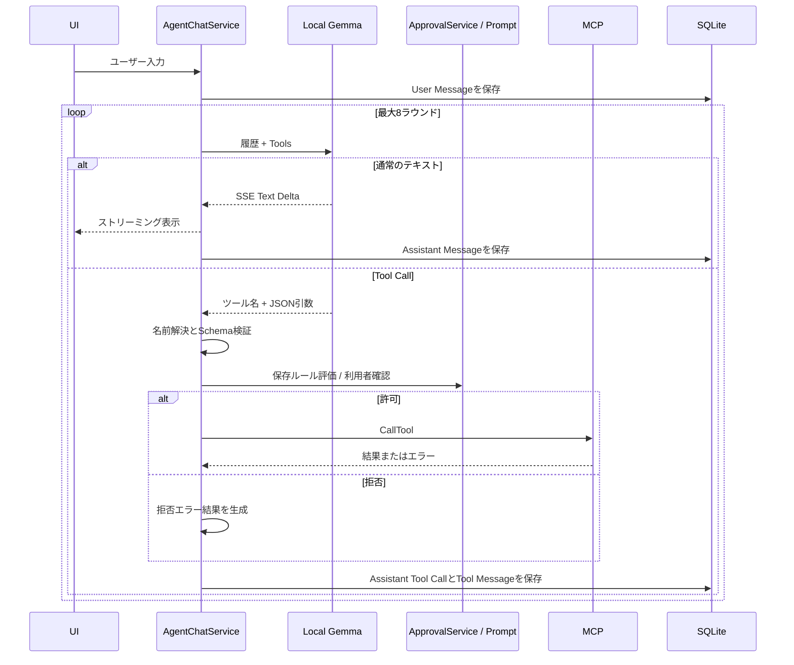
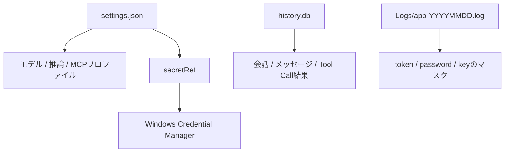

# アーキテクチャ

LocalMCPChatClientは、WPF UI、ドメイン、外部I/Oを分離したWindowsデスクトップアプリです。ローカルLLMへの推論要求とMCPサーバーへのツール要求を、アプリ内の承認・保存境界で調停します。

## 全体像

## プロジェクト境界

| プロジェクト | 責務 | 主な依存先 |
|---|---|---|
| `LocalMCPChatClient.Core` | ドメインモデル、保存形式、外部機能のインターフェース | .NET標準ライブラリ |
| `LocalMCPChatClient.Infrastructure` | SQLite、llama.cpp管理、推論HTTP、MCP SDK、Credential Manager、取得処理 | Core、外部ライブラリ |
| `LocalMCPChatClient.App` | WPF、MVVM、DI、日本語UI、初回ウィザード、承認ダイアログ | Core、Infrastructure |
| `LocalMCPChatClient.Tests` | 推論、承認、設定、SQLite、MCPの自動テスト | Core、Infrastructure |
| `LocalMCPChatClient.TestServer` | 統合テスト用のStreamable HTTP MCPサーバー | MCP SDK |

`Core`はWPF、SQLite、MCP SDKへ依存しません。UI固有の確認処理は`IToolApprovalPrompt`、外部I/Oは各インターフェースを通して差し替えられます。

## アプリ起動

前回異常終了時の`llama-server.pid`にはPIDと実行ファイルの完全パスを保存します。次回起動時は双方が一致するプロセスだけを回収し、無関係な同名プロセスを停止しません。

## ローカル推論

`LlamaRuntimeManager`が`llama-server`を子プロセスとして起動します。

- OSが割り当てた空きポートを使用する
- `127.0.0.1`だけで待ち受ける
- 起動ごとにランダムなBearer APIキーを生成する
- `--jinja`でチャットテンプレートとTool Callを有効にする
- `--no-webui`で内蔵Web UIを無効にする
- CPUでは`--n-gpu-layers 0`、GPUではオフロード可能な全レイヤーを要求する
- `/health`を確認してからReadyに遷移する

`LlamaInferenceService`は、OpenAI互換`/v1/chat/completions`へ会話履歴とToolsを送り、SSEを`InferenceUpdate`へ変換します。キャンセルトークンはHTTP要求と子プロセス管理へ伝播します。

Autoモードは、有効な速度診断結果を最優先し、NVIDIA環境ではCuda → Vulkan → Cpu、それ以外ではVulkan → Cpuの順で起動します。実行前に`--list-devices`でバックエンドとデバイスの組み合わせを確認し、最後に成功した方式を設定へ保存します。Cpu / Cuda / Vulkanの明示指定では別方式へ自動フォールバックしません。

メイン画面は会話履歴を読み込んだ時点で表示し、MCP接続とモデルのプリロードをバックグラウンドで並行します。プリロードはモデル読み込み後に保存しない1トークン推論を実行し、初回のGPUカーネル準備を済ませます。同一プロファイルへの複数要求は一つの準備処理を共有します。

ストリーミングdeltaは`StreamingTextBuffer`へ蓄積し、最初だけ即時、その後は最大20回/秒でUIへ通知します。生成中はプレーンテキストを表示し、完了時に一度だけMarkdownを構築します。

速度診断はインストール済み`llama-bench`を使用し、結果をモデル・ランタイム・CPU/GPU・ドライバーのfingerprintとともに`settings.json`へ保存します。fingerprintが変わった結果はAuto選択に使用しません。

## チャットとTool Callループ

`AgentChatService`は会話単位の1ターンを次の順で処理します。

システム指示に加え、llama-serverへ`reasoning_effort=none`と`chat_template_kwargs.enable_thinking=false`を渡します。これにより、推論用トークンが本文表示前に出力上限を消費することを防ぎます。Tool Callと承認フローは従来どおり利用できます。

未知のツール、壊れたJSON、Schema違反、接続切断、拒否、タイムアウトはツールを実行せず、エラー結果としてモデルとUIへ返します。複数Tool Callは順番に承認・実行します。

MCPツール名は`<serverId>__<toolName>`に正規化します。OpenAI互換APIの64文字制限を超える場合や使用できない文字がある場合は、安定したハッシュ接尾辞を付けて短縮します。

## MCP接続

`McpConnectionManager`は公式MCP C# SDKを使用します。

### stdio

- commandと引数を分離し、シェルを介さず起動する
- SDKが定める既定環境変数と、プロファイルで明示した値だけを渡す
- 標準エラーを診断ログへ取り込む
- 接続ごとにサーバープロセスのライフサイクルを管理する

### Streamable HTTP

- リモートはHTTPS必須、HTTPはループバックだけ許可する
- 任意ヘッダー、Credential Manager参照、Bearerトークン環境変数を解決する
- サーバーごとに接続開始・ツール実行タイムアウトを適用する
- 必要に応じてstandalone GETとContent-Length付き要求を使用する

一つのMCPサーバーが失敗しても、他の接続と通常のローカルチャットは継続できます。

`McpProfileJsonImporter`は`servers` / `mcpServers`形式を内部の`McpServerProfile`へ正規化します。秘密らしい環境変数とHTTPヘッダーは公開項目から分離し、設定保存前にCredential Manager参照へ変換します。同名設定の再インポートでは既存サーバーIDを維持するため、ツール承認ルールのスコープは変わりません。

## 保存と秘密情報

設定ファイルは一時ファイルへ書き出してから置換し、途中書き込みによる破損を避けます。JSONが破損している場合は`.corrupt-<timestamp>`へ退避して既定値を再作成します。

秘密として入力した環境変数・HTTPヘッダーの実体はWindows Credential Managerへ保存し、`settings.json`には`secretRef`だけを残します。通常欄に入力した値は平文保存であるため、秘密値には使用しません。

設定の全リセットでは、推論プロセスとMCP接続を停止し、承認ルールのインメモリ状態、`LocalMCPChatClient/`接頭辞のCredential Manager項目、`settings.json`を初期化します。会話DB、モデル、ランタイム、ログは設定とは別のデータとして保持します。

`MarkdownConversationExporter`は会話とメッセージを読み取り、UTF-8（BOMなし）で利用者が指定したパスへ書き出します。本文に加えてTool Call JSONとツール結果を保持し、コードフェンス内のバッククォート列に応じてフェンス長を調整します。

## アーティファクト管理

モデルとランタイムはPortable ZIPやGitリポジトリに含めません。小さなJSONカタログで取得元を固定し、`ArtifactInstaller`が次を担当します。

- ダウンロード前の空き容量確認
- HTTP Rangeによる`.partial`ファイルからの再開
- 取得後のサイズとSHA-256検証
- ZIP展開時のディレクトリトラバーサル防止
- 既存GGUFまたは`llama-server.exe`のインポート

組み込みモデル情報は`catalog/models.json`、ランタイム情報は`catalog/runtimes.json`と、実行時に利用する`BuiltInArtifacts`で管理します。

## セキュリティ境界

アプリが提供する主な境界は次の通りです。

- ローカル推論APIをループバックと一時キーで保護する
- MCPリモート接続にHTTPSを要求する
- Tool Callを実行前に検証・承認する
- 秘密値をCredential Managerへ分離する
- ログの一般的な秘密形式をマスクする

MCPサーバー自体のサンドボックス化は行いません。許可されたツールが実行するファイル操作、プロセス起動、外部通信の安全性は、そのMCPサーバーの実装と設定にも依存します。

## テスト戦略

- 単体テスト: 設定正規化、秘密参照、承認スコープ、ツール名、引数検証
- 推論テスト: 偽のOpenAI互換APIによるSSE、Tool Call解析、キャンセル
- MCP統合テスト: テスト用stdio / HTTPサーバーによる接続、列挙、実行、タイムアウト
- 保存テスト: SQLiteの作成、追加、削除、再生成対象の復元
- 手動E2E: E2B/E4B、CPU/CUDA/Vulkan、日本語Tool Call、オフライン再起動、Portable初回導入
