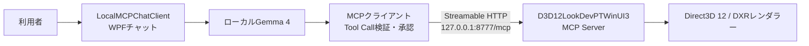

# D3D12LookDevPTWinUI3との連携例

このページでは、LocalMCPChatClientのローカルGemmaから、別アプリの[D3D12LookDevPTWinUI3](https://github.com/shaderjp/D3D12LookDevPTWinUI3)へMCP接続し、レンダラーの状態確認や設定変更を日本語チャットで行う例を説明します。

4枚目のスクリーンショットは接続先のMCPサーバーアプリです。D3D12LookDevPTWinUI3はこのリポジトリやLocalMCPChatClientのReleaseには含まれません。



## 1. 事前準備

- LocalMCPChatClientでGemma 4 E2BまたはE4Bと推論ランタイムを準備しておく
- D3D12LookDevPTWinUI3を同リポジトリの[日本語README](https://github.com/shaderjp/D3D12LookDevPTWinUI3/blob/main/README.ja.md)に従ってビルド・起動する
- D3D12LookDevPTWinUI3側で、確認に使うシーンまたはプロジェクトを開く

D3D12LookDevPTWinUI3はWindows 11 x64、DXR Tier対応GPU、C++/WinUI開発環境を対象としています。詳細な対応環境とアセットの準備方法は接続先リポジトリの文書を正としてください。

## 2. D3D12LookDevPTWinUI3のMCPサーバーを起動する


1. 画面下部の「MCP Server」パネルを開く
2. Portを`8777`にする
3. Request Timeoutを`120`秒にする
4. Access Modeを選択する
5. 「Copy Token」でBearerトークンを取得する
6. 「Start Server」を選択する

Access Modeの違いは次の通りです。

| モード | 動作 |
|---|---|
| `read_only` | 状態参照だけを許可し、設定変更を拒否する |
| `confirm_mutations` | 設定変更をD3D12LookDevPTWinUI3のMCPパネルで承認・拒否する |
| `allow_mutations` | サーバー側の追加承認なしで設定変更を実行する |

初回確認では`confirm_mutations`を推奨します。この場合、LocalMCPChatClientのTool Call承認に加え、D3D12LookDevPTWinUI3側でもmutationのApproveが必要です。どちらかで拒否した操作は実行されません。

サーバーは`127.0.0.1`だけで待ち受けます。Bearerトークンは秘密情報です。画像、Markdown保存した会話、Issue、README、Git管理ファイルへ含めないでください。

## 3. LocalMCPChatClientへ接続を登録する

「設定」→「MCP接続」→「＋ HTTP」を選び、次を入力します。

| UI項目 | 値 |
|---|---|
| 表示名 | `D3D12LookDevPTWinUI3` |
| 有効 | オン |
| Streamable HTTP URL | `http://127.0.0.1:8777/mcp` |
| standalone GET | オフ |
| Content-Length | オフのままで可 |
| Bearerトークンの環境変数名 | `D3D12LOOKDEVPT_MCP_TOKEN` |
| HTTPヘッダー | `MCP-Protocol-Version=2025-11-25` |
| 接続開始タイムアウト | `10` |
| ツール実行タイムアウト | `120` |

Windowsのユーザー環境変数`D3D12LOOKDEVPT_MCP_TOKEN`へ、D3D12LookDevPTWinUI3でコピーしたトークンだけを設定します。環境変数を追加・変更した後は、LocalMCPChatClientを完全に終了してから起動し直してください。

環境変数の代わりにWindows Credential Managerを使う場合は、環境変数名を空にし、「秘密のHTTPヘッダー」へ次を入力します。

```text
Authorization=Bearer <D3D12LookDevPTWinUI3でコピーしたトークン>
```

環境変数方式と秘密ヘッダー方式は同時に設定しません。「接続テスト」で成功を確認してから「保存」を選びます。

> [!NOTE]
> D3D12LookDevPTWinUI3はHTTP POSTによるStreamable HTTP形式を実装し、standalone GET/SSEは実装していません。「standalone GET」はオフにしてください。セッションIDの取得と送信はMCP C# SDKが処理します。

## 4. 利用可能な機能を会話で確認する


メイン画面右上のMCP表示で接続数とTool数を確認し、例えば次のように送信します。

```text
このツールではMCPで何ができますか？
```

Gemmaは接続時に取得したTool定義を基に、シーン、カメラ、ライティング、マテリアル、パストレーシング、デノイズなどの操作を説明します。回答はモデル生成なので、正確な引数と対応機能は接続時の`tools/list`結果を優先してください。

## 5. 露出を変更する

次のように送信します。

```text
露出を1.0にして
```

Gemmaが`lookdevpt.set_color_management`に対応する名前空間化Toolを選ぶと、LocalMCPChatClientが引数を検証して承認画面を表示します。「今回のみ許可」または「常に許可」を選ぶとMCPサーバーへ要求を送ります。

`confirm_mutations`を使用している場合は、続けてD3D12LookDevPTWinUI3のMCP Serverパネルで要求をApproveします。完了後、LocalMCPChatClientにはTool Callカードと最終回答が表示されます。


D3D12LookDevPTWinUI3の右側「Viewport」パネルでもExposureが`1`になっていることを確認できます。変更直後の状態参照はレンダラーのスナップショット更新よりわずかに早い場合があるため、必要ならもう一度状態を質問してください。

## 6. 通常の会話を続ける

MCP接続中でも、すべての質問でToolを実行するわけではありません。次の例ではトーンマッパーの選択肢を確認し、続けてACESについて質問しています。


```text
トーンマッパーの種類は？
ACESとはどんなトーンマッパーですか？
```

説明だけで回答できる場合、Gemmaは通常のチャット応答を返します。実際の値を変更したい場合は「トーンマッパーをACESにして」のように、対象と変更内容を明示します。

## 対応範囲

D3D12LookDevPTWinUI3のMCPサーバーはToolsに加えてResourcesとPromptsも公開しますが、LocalMCPChatClient `0.1.1`はTools中心の初期版です。本アプリから利用できるのは接続時にToolsとして列挙された機能です。

サーバーの完全なTool一覧、スキーマ、Resources、Promptsは[D3D12LookDevPTWinUI3のMCPサーバー文書](https://github.com/shaderjp/D3D12LookDevPTWinUI3/blob/main/docs/mcp.ja.md)を参照してください。

## 接続できない場合

- `401 Unauthorized`: トークンをコピーし直し、環境変数または秘密ヘッダーを更新して再接続する
- `GET /mcp`が`405`: 「standalone GET」をオフにする。同サーバーでは想定された応答
- Protocol Versionエラー: `MCP-Protocol-Version=2025-11-25`を確認する
- mutationが完了しない: D3D12LookDevPTWinUI3のMCP Serverパネルに承認待ちがないか確認する
- タイムアウトする: 両アプリのタイムアウトを確認し、D3D12LookDevPTWinUI3側の要求を時間内にApproveする
- Tool一覧が更新されない: LocalMCPChatClientで接続し直す

一般的な確認項目は[トラブルシューティング](troubleshooting.md#mcpサーバーへ接続できない)も参照してください。
