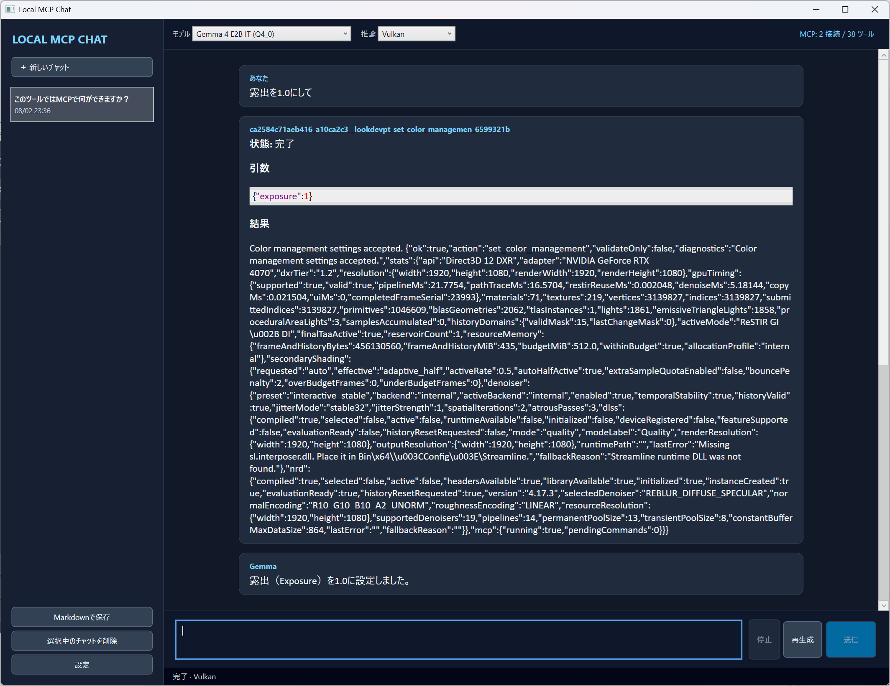
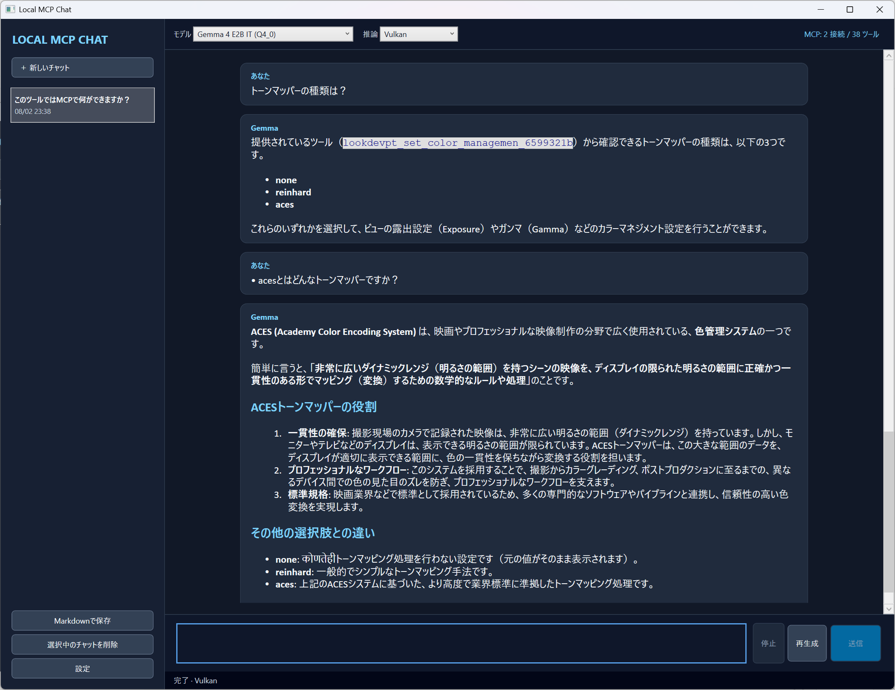

# 操作ガイド

## メイン画面

メイン画面は、会話一覧、チャット本文、モデル・推論状態、入力欄で構成されます。

画面右上には接続中のMCPサーバー数と、利用可能なTool数が表示されます。上の例では、ローカルGemmaがD3D12LookDevPTから取得したToolsを基に回答しています。

### 会話一覧

- 「新しいチャット」: 空の会話を作成する
- 会話項目: 選択した会話の履歴を表示する
- 「Markdownで保存」: 選択した会話を`.md`ファイルとして保存する
- 「選択中のチャットを削除」: 確認後、選択した会話だけを削除する
- 「設定」: モデル、推論、MCP、承認ルール、データ設定を開く

すべての会話履歴を削除する場合は、「設定」→「承認とプライバシー」から実行します。この操作は元に戻せません。

### Markdownで保存

保存する会話を選び、「Markdownで保存」を選択して保存先を指定します。出力には次の情報が含まれます。

- 会話タイトル、会話ID、作成・更新日時、モデルID
- ユーザー、Gemma、システムのメッセージと時刻
- Tool CallのJSON、ツール名、Call ID、結果、成功・失敗状態
- 添付Resourceのサーバー、URI、読取日時、切り詰め状態、保存済み本文

UTF-8（BOMなし）で保存されます。メッセージ本文はMarkdownのまま保持されるため、一般的なMarkdownビューアーで閲覧できます。ツール引数や結果に秘密情報が含まれている可能性があるため、保存ファイルを共有する前に内容を確認してください。

### 上部バー

- 「モデル」: 使用する登録済みGGUFを選択する
- 「推論」: Auto / Cpu / Cuda / Vulkanを選択する
- 「MCP」状態: 接続数と利用可能なツール数を表示する

モデルまたは推論モードの変更は設定へ保存され、起動時プリロードが有効な場合は直ちに`llama-server`の準備を開始します。

### チャット本文

ユーザー、Gemma、ツール実行結果を時系列で表示します。Gemmaの回答はMarkdownとして描画され、見出し、リスト、強調、コードブロックなどに対応します。

ツール実行後は、ツール名、引数、結果、成功または失敗の状態がメッセージとして保存されます。

Tool Callカードには名前空間化されたツール名、検証済みJSON引数、MCPサーバーの結果が表示されます。結果が長い場合はチャット本文が縦に伸びるため、スクロールしてGemmaの最終回答まで確認してください。

ツールを実行しない通常の質問も同じ会話で継続できます。次の例では、利用可能な設定値を確認した後、ACESトーンマッパーについて説明を求めています。

### 入力と生成

- 「送信」: 入力内容を送信し、ストリーミング生成を開始する
- 「停止」: 現在の生成またはツール処理をキャンセルする
- 「再生成」: 直前のターンを削除し、同じユーザー入力でもう一度生成する

生成中は同時に別のメッセージを送信できません。

## モデルと推論設定

「設定」→「モデルと推論」で変更します。

### モデル

- 「選択モデルをダウンロード」: 組み込みカタログのモデルを取得して検証する
- 「既存GGUFを登録」: 手元のGGUFをアプリ管理下へコピーして登録する
- 「モデル保存先」: モデルの保存ディレクトリを変更する

モデル保存先を変更しても、既に登録済みのモデルパスは自動移動されません。

### 推論ランタイム

- 「チャットモード」: 実際の生成で使うAuto / Cpu / Cuda / Vulkan
- 「取得するbackend」: ダウンロードする`llama-server`の種類
- 「backendをダウンロード」: 選択したランタイムを取得して展開する
- 「既存llama-serverを登録」: 手元の実行ファイルを登録する

明示的にCudaまたはVulkanを選んだ場合、起動失敗時に自動でCPUへ切り替わりません。エラー内容を確認して、必要なら手動でCpuを選択してください。

「起動時にモデルを準備する」は既定で有効です。アプリ画面を表示した後にモデル読み込みと短いウォームアップをバックグラウンドで行い、完了すると状態欄に使用バックエンドを表示します。VRAMを常時使用したくない場合は無効にできます。

「速度診断を実行」は、現在のモデルとインストール済みの互換バックエンドを最大60秒測定します。モデルやランタイムを追加取得せず、結果を確認してから「推奨設定を適用」を押すまで推論モードは変更しません。診断中はモデルをVRAMから解放するため、終了後に再準備します。

回答完了時の状態欄には、使用バックエンド、最初の文字までの時間、生成速度が表示されます。値は端末内の診断ログにも記録されます。

### 生成設定

| 設定 | 既定値 | 説明 |
|---|---:|---|
| コンテキスト長 | 8192 | 会話履歴とツール定義を含めてモデルへ渡す最大コンテキスト |
| 最大出力トークン | 2048 | 1回の推論で生成する上限 |
| Temperature | 0.7 | 低いほど出力が安定し、高いほど変化しやすい |

コンテキスト長を大きくすると、特にGPU推論時のメモリ使用量が増えます。

## MCPツールの承認

モデルがツールを選択すると、実行前にサーバー名、ツール名、JSON引数を表示します。

| 選択 | 動作 |
|---|---|
| 今回のみ許可 | この呼び出しだけを実行する |
| 常に許可 | 同じサーバーIDとツール名の組み合わせを今後自動許可する |
| 拒否 | ツールを実行せず、拒否結果をモデルへ返す |

保存した承認ルールは「設定」→「承認とプライバシー」で確認・全消去できます。引数の内容ごとではなく、サーバーとツールの組み合わせ単位で適用される点に注意してください。

## MCP Resourceを添付する

接続中のMCPサーバーが静的Resourceを公開している場合、入力欄の「Resourceを追加」から次のメッセージへ資料を添付できます。

1. 「Resourceを追加」を選ぶ
2. 名前、サーバー、URI、説明、MIME typeで検索する
3. 必要に応じて項目を選び、「選択項目をプレビュー」で本文を確認する
4. 複数のResourceへチェックを付け、「選択したResourceを追加」を選ぶ
5. 入力欄上のチップを確認してメッセージを送信する

一覧は選択画面を開いたときに取得され、「一覧を更新」で手動更新できます。サーバーごとの取得失敗は画面上部へ個別に表示され、ほかのサーバーのResourceは引き続き選択できます。

Resourceは次の1回の送信だけに添付されます。送信時にすべてのResourceを読み取れた場合だけメッセージを保存し、失敗またはキャンセル時は入力本文と選択チップを維持します。送信後は読取時点の本文を会話履歴へ保存するため、再生成時にサーバーへ再接続したり最新内容を読み直したりしません。

ユーザーメッセージの「添付Resource」を展開すると、サーバー名、URI、本文、切り詰め状態を確認できます。Markdown保存にも同じ監査情報と本文が含まれます。

制限事項:

- 対応する本文は`TextResourceContents`だけです。BlobだけのResourceは添付できません。
- テキストとBlobが混在する場合はテキストだけを使用し、バイナリの省略を表示します。
- 1 Resourceは最大256 KiBです。さらに、全添付は設定したコンテキスト長の25%を上限として均等に切り詰められます。
- Resource Templates、引数補完、変更購読、自動再読込、MCP Promptsには未対応です。
- Resource本文は信頼できない外部データとしてモデルへ渡されます。添付前にプレビュー内容と接続先を確認してください。

## MCP設定JSONのインポート

「設定」→「MCP接続」→「JSONからインポート」から、`servers`または`mcpServers`形式の設定ファイルを読み込めます。同名のサーバーは置き換えられ、Authorizationやトークンなどの秘密値はWindows Credential Managerへ保存されます。元のJSONに含まれる秘密値は削除されないため、ファイル自体も安全に管理してください。

## データとログ

「設定」→「承認とプライバシー」には、データ保存先とログ保存先が表示されます。

- 会話履歴: SQLiteの`history.db`
- 一般設定とMCPプロファイル: `settings.json`
- 診断ログ: 日付単位の`Logs\app-YYYYMMDD.log`

ログでは一般的なトークン、パスワード、APIキー形式をマスクしますが、MCPツールの引数や結果に秘密情報を含めない運用を推奨します。

### ライセンス情報

「設定」→「承認とプライバシー」→「ライセンス情報を表示」から、LocalMCPChatClient、.NET/WPF、MCP C# SDK、SQLite関連ライブラリのライセンスと第三者通知を確認できます。単体EXEでも文書はアプリ内に埋め込まれているため、別ファイルなしで表示できます。

### すべての設定を初期化

「設定」→「承認とプライバシー」→「すべての設定を初期化」から、次の設定を既定値へ戻せます。

- モデル登録とモデル保存先
- 推論モード、コンテキスト長、最大出力、Temperature
- カスタム`llama-server`登録
- MCPプロファイルと現在のMCP接続
- ツール承認ルール
- LocalMCPChatClientがWindows Credential Managerへ保存した秘密情報
- 初回セットアップ完了状態

チャット履歴、ダウンロード済みモデル、推論ランタイム、ログは削除されません。リセット時に動作中の推論とMCP接続を停止し、次回起動時に初回セットアップを表示します。
